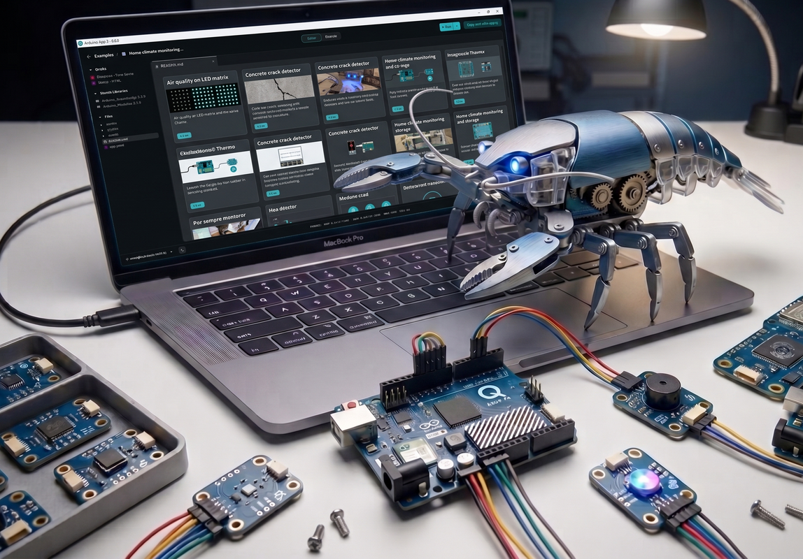

# QClaw — App Lab Edition

QClaw is an on-device agentic AI for the **Arduino Uno Q**, packaged as a one-click [Arduino App Lab](https://docs.arduino.cc/app-lab/) application. The agent — local `llama-server`, 8 tools, 15-skill workspace — runs entirely on the QRB2210, with the chat surface served as an `arduino:web_ui` brick at `http://<uno-q-ip>:7000`.

| | |
|---|---|
| **Board** | Arduino Uno Q (Qualcomm QRB2210 · 4× Cortex-A53 · 4 GB LPDDR4X) |
| **Engine** | yzma `llama-server` (llama.cpp build 9127, ARMv8 CPU) |
| **Default model** | Qwen3.5-0.8B Q4_0 (~537 MB, downloaded on first launch) |
| **Cloud option** | Claude API via Anthropic, configurable through the WebUI |
| **Card icon** | 🦞 |

---

## Quick Start

### 1 · Install the app in Arduino App Lab

On your Uno Q:

```bash
# Download the release ZIP
curl -L -o QClaw.zip https://github.com/laurenvil/Uno-QClaw/releases/download/v1.0.2/QClaw.zip

# Import into App Lab
arduino-app-cli app import QClaw.zip
```

Or use the **Import App** button in the Arduino App Lab GUI and pick the ZIP.

After import, the card appears with a 🦞 icon and the description *"On-device agentic AI for the Arduino Uno Q."*

### 2 · Start the app

```bash
arduino-app-cli app start ~/ArduinoApps/qclaw
```

Or click **Start** on the QClaw card in the App Lab GUI.

The first launch:

1. Downloads `Qwen_Qwen3.5-0.8B-Q4_0.gguf` (~537 MB) from the public ggml-org mirror on Hugging Face — cached to `~/models/` so subsequent starts are instant.
2. Extracts the embedded workspace (`SOUL.md`, `IDENTITY.md`, 15-skill tree, …) into `~/.qclaw/workspace/`.
3. Exposes every workspace entry under `agent/` via the host bind-mount so the App Lab UI can edit them.
4. Brings up `llama-server` on `127.0.0.1:8083`.
5. Serves the WebUI on `:7000`.

When the App Lab log says **`App started`**, the board is ready.

### 3 · Open the WebUI

```
http://<uno-q-ip>:7000
```

The local URL appears in the App Lab Python log:

```
[main] WebUI: The application interface is available here:
[main]   - Local URL:   http://localhost:7000
[main]   - Network URL: http://192.168.1.xx:7000
```

Type a prompt, watch tokens stream back. The first prompt after a fresh boot does a cold prefill of the system prompt — that takes 10–60 s; subsequent prompts respond in 2–5 s using cached KV state.

---

## Host arduino-cli Daemon (optional)

The agent's `arduino` tool — compile a sketch, flash it to the MCU at `0x08100000` over linuxgpiod — needs a host-side proxy daemon. **Chat works without it.** Install only if you want the agent to write, compile, and upload Arduino sketches end-to-end.

On the Uno Q (not inside the App Lab container):

```bash
# Arduino CLI + Uno Q board core
sudo apt update && sudo apt install -y arduino-cli
arduino-cli core install arduino:zephyr

# Daemon source — point at the qclaw-arduino-daemon.py you obtain from
# the QClaw source distribution (it is not shipped in the App Lab ZIP).
DAEMON_PY="$HOME/qclaw-arduino-daemon.py"

mkdir -p ~/.config/systemd/user
cat > ~/.config/systemd/user/qclaw-arduino-daemon.service <<EOF
[Unit]
Description=QClaw arduino-cli host daemon
After=network.target

[Service]
Type=simple
ExecStart=/usr/bin/python3 ${DAEMON_PY}
Restart=on-failure
RestartSec=5s
Environment=QCLAW_APPS_DIR=%h/ArduinoApps
Environment=QCLAW_ARDUINO_TIMEOUT=600

[Install]
WantedBy=default.target
EOF

systemctl --user daemon-reload
systemctl --user enable --now qclaw-arduino-daemon.service
```

The WebUI shows a yellow banner at the top of the page until the daemon socket appears at `~/ArduinoApps/qclaw/.cache/qclaw-arduino-daemon.sock`. Once it does, the banner self-dismisses and the `arduino` tool starts working.

---

## WebUI Settings

The **gear icon** in the WebUI opens the settings panel. Three things live there:

### Active model

A dropdown listing every entry from `~/.qclaw/config.json`'s `model_list`. Switching the selection swaps which model the agent uses for the next prompt — local yzma, Claude API, or anything else you've registered. Edits persist across container restarts.

### Add model

Adds a new entry to `model_list`. Required fields:

| Field | What it does |
|---|---|
| `model_name` | Label shown in the dropdown |
| `model` | Provider-specific model identifier (e.g. `claude-opus-4-7`) |
| `api_base` | HTTPS endpoint (or local binary path for yzma-family engines) |
| `api_key` | Provider API key, or `local` for on-device engines |
| `request_timeout` | Seconds — 60 is fine for cloud, ≥1200 for cold local prefill |
| `extra_body` | Provider-specific tuning (yzma `extra_args`, OpenAI-style `temperature`, …) |

### Delete model

Removes an entry. The default yzma entry can be deleted only if at least one other model exists.

---

## Testing Local On-Device Inference (yzma)

The yzma `llama-server` is embedded in the App Lab ZIP under `engines/yzma/lib/`:

```
engines/yzma/lib/
├── llama-server                    # llama.cpp build 9127, ARMv8 aarch64
├── libllama.so.0.0.9127
├── libggml.so.0.11.1
├── libggml-cpu-armv8.0_1.so
└── … (~25 .so files)
```

On boot, QClaw spawns this command verbatim:

```bash
engines/yzma/lib/llama-server \
  -m ~/models/Qwen_Qwen3.5-0.8B-Q4_0.gguf \
  --host 127.0.0.1 --port 8083 \
  -t 4 -c 9000 -np 1 \
  --reasoning off --jinja --log-disable \
  --flash-attn on --mlock \
  --cache-type-k q8_0 --cache-type-v q8_0 \
  --reasoning-budget 800
```

You can probe it directly while QClaw is running:

```bash
curl -s http://127.0.0.1:8083/v1/chat/completions \
  -H "Content-Type: application/json" \
  -d '{
    "model": "yzma",
    "messages": [{"role":"user","content":"reply with exactly two words: hello world"}],
    "stream": false
  }'
```

The yzma config (threads, ctx size, KV-cache quantisation, repeat-penalty, …) lives in `model_list[0].extra_body` of `config/qclaw.config.json`. Tune in place; restart the app to pick up changes.

**Switching local model variants:** drop another `Qwen_*.gguf` into `~/models/` and either pick the matching pre-registered entry (e.g. `yzma-q4kxl`) from the WebUI dropdown, or add a new entry pointing at the new filename.

---

## Using Claude API Models

Open the WebUI settings → **Add model** and fill in:

```jsonc
{
  "model_name":      "claude-opus",
  "model":           "claude-opus-4-7",
  "api_base":        "https://api.anthropic.com/v1",
  "api_key":         "sk-ant-…your-Anthropic-key…",
  "request_timeout": 120,
  "extra_body": {
    "max_tokens":  2048,
    "temperature": 0.3,
    "anthropic_beta": ["prompt-caching-2024-07-31"]
  }
}
```

Pick the new entry from the model dropdown. The agent loop, tools, and 15-skill workspace are **identical** regardless of model — only inference moves off-board. Useful when you want sharper reasoning than the on-device 0.8 B model can deliver, or when you're not on Wi-Fi-isolated workflows.

Available `model` strings for Anthropic at the time of this release:

| `model` | Family |
|---|---|
| `claude-opus-4-7` | Opus 4.7 — top-tier reasoning |
| `claude-sonnet-4-6` | Sonnet 4.6 — balanced |
| `claude-haiku-4-5-20251001` | Haiku 4.5 — fastest |

The agent's tool-calling, streaming, and channel routing work the same regardless of which Claude model you pick.

---

## What's in `agent/`

After first start, every workspace entry is exposed under `agent/` via the host bind-mount so the App Lab UI can edit any of them:

```
agent/
├── SOUL.md              # System prompt + persona (must start with /no_think)
├── IDENTITY.md          # Board-specific identity
├── AGENTS.md            # Agent loop knobs
├── USER.md              # User-personalisation seed
├── memory/
│   └── MEMORY.md        # Persistent agent memory
├── skills/              # 15 skill bundles
│   ├── arduino-app-lab/
│   ├── audio/
│   ├── bridge/
│   ├── github/
│   ├── led-matrix/
│   ├── linux-led/
│   ├── modulino/
│   ├── sketch-patterns/
│   ├── skill-creator/
│   ├── summarize/
│   ├── tmux/
│   ├── uno-q-hardware/
│   ├── vision/
│   ├── weather/
│   └── wireless/
├── sketches/            # User sketches written by the `arduino` tool
└── python/              # User Python scripts
```

Edits to any of these survive container restarts. The actual files live at `~/.qclaw/workspace/` inside the container; the `agent/` entries are symlinks into that workspace whose targets sit on the host bind-mount, so what you see in App Lab is what the agent reads on its next turn.

---

## Configuration Reference

The active runtime config is `~/.qclaw/config.json`. The template at `config/qclaw.config.json` in the App Lab ZIP is copied there only on first launch — subsequent edits go straight to `~/.qclaw/config.json` and persist across container restarts.

| Top-level key | Purpose |
|---|---|
| `agents.defaults` | Default agent runtime knobs (workspace path, model, `max_tokens`, `max_tool_iterations`, summarisation thresholds) |
| `model_list[]` | Registered models — each has `model_name`, `model`, `api_base`, `api_key`, `request_timeout`, `extra_body` |
| `tools.*` | Per-tool settings (camera device, LED sysfs paths, I²C bus list, filesystem roots) |
| `channels.*` | Optional Telegram / Discord / Matrix / IRC / Slack tokens for multi-channel chat |

The 8 built-in tools the agent can call:

| Tool | What it does |
|---|---|
| `arduino` | `arduino-cli compile` + OpenOCD flash to MCU at `0x08100000` (needs the host daemon) |
| `camera` | GStreamer V4L2 single-frame capture |
| `sysfs_led` | Drive MPU RGB LEDs through `/sys/class/leds/*/brightness` |
| `network` | Read-only hostname / interfaces / default gateway |
| `i2cdetect` | List `/dev/i2c-*` buses, `i2cdetect -y -r <bus>` |
| `read_file`, `write_file`, `list_dir` | Workspace-scoped filesystem access |

---

## Troubleshooting

| Symptom | Fix |
|---|---|
| **WebUI loads but the model never responds** | First prompt is a cold prefill — wait up to 60 s. Subsequent prompts are 2–5 s. |
| **Yellow daemon banner won't go away** | The host `qclaw-arduino-daemon.service` isn't running. See *Host arduino-cli Daemon* above. The chat path works without it. |
| **Model download stalled** | Check internet; the GGUF lives at `https://huggingface.co/ggml-org/Qwen3.5-0.8B-GGUF/`. Drop it into `~/models/` manually to skip the download. |
| **`arduino` tool returns exit 127** | Daemon socket not reachable. Install + start the systemd user unit. |
| **WebUI says `Connection refused`** | Container died — usually OOM under heavy agent load. Restart with `arduino-app-cli app start ~/ArduinoApps/qclaw`. |
| **Want to wipe runtime state and reset** | `rm -rf ~/.qclaw/workspace ~/.qclaw/config.json` then restart the app. The embed re-extracts on next boot. |

---

## License

[MIT](LICENSE).
