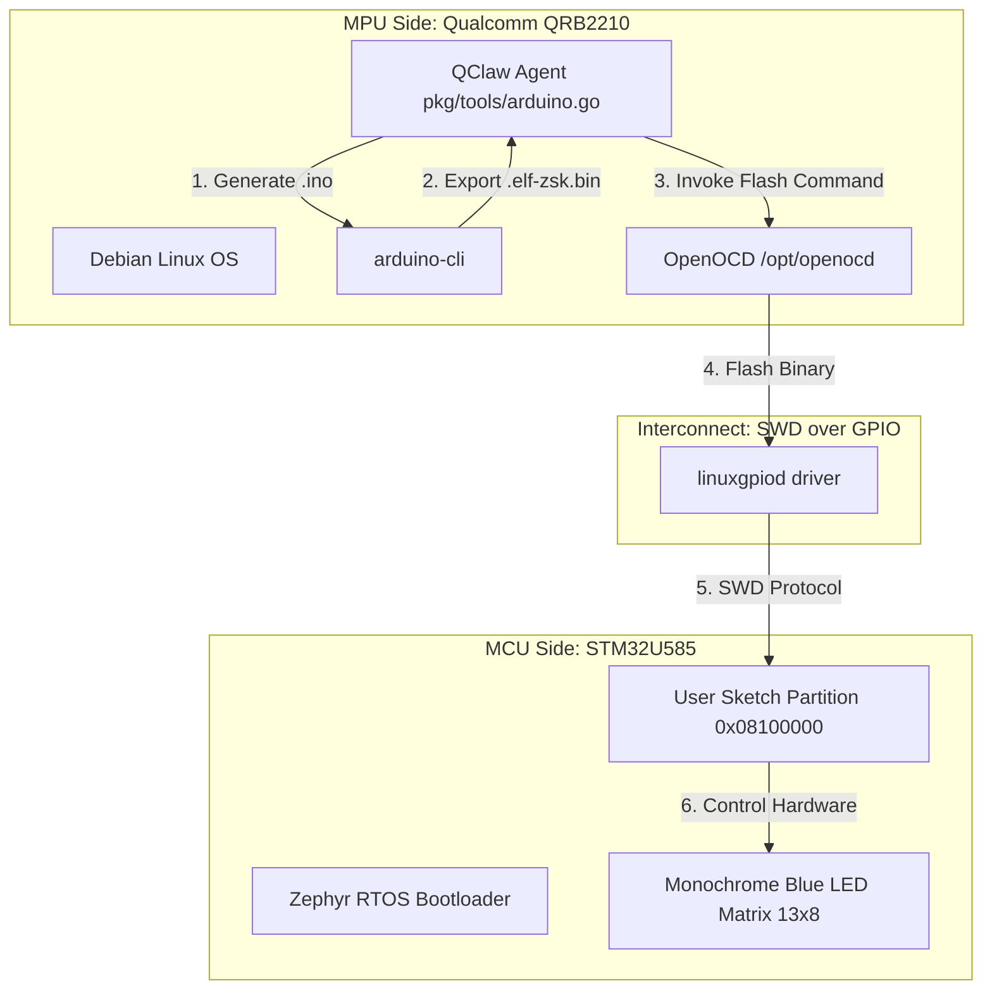

# On-Device MCU Orchestration: Compiling, Uploading, and Flashing in QClaw v3

**A Technical Whitepaper**  
**Branch:** `qclaw-v3`  
**Target Hardware:** Arduino Uno Q (Qualcomm QRB2210 MPU & STM32U585 MCU)  
**Author:** Antigravity AI  

---

## Executive Summary

In traditional IoT and embedded education environments, deploying software to a microcontroller (MCU) requires a secondary host machine (such as a laptop) connected via USB, or network-bound OTA (Over-the-Air) services requiring robust network infrastructure. The **Arduino Uno Q** breaks this paradigm by co-locating a powerful Application Processor (MPU) running Linux and an energy-efficient MCU on a single board.

This whitepaper provides an exhaustive architectural deep dive into how **QClaw v3** implements autonomous, local, and offline compilation, uploading, and flashing of Arduino sketches to the MCU. It details the compile pipeline, explains the critical OpenOCD flashing fix at target address `0x8100000`, and contrasts QClaw's local direct SWD method with other methods like Arduino's remote flashing tool, `remoteocd`.

---

## 1. Split-Processor Architecture

The communication and deployment model of the Arduino Uno Q is governed by its dual-silicon topology:



### 1.1 MPU Side (Qualcomm QRB2210)
- **Processor:** 4 × ARM Cortex-A53 @ 2.0 GHz
- **Operating System:** Debian Linux (kernel 6.16)
- **Role:** Host environment running the `qclaw` agent framework, local compilation toolchain, and debugging suites. Inference is in-process: `pkg/providers/llamacli` spawns the precompiled `engines/llamacli/mpu/llama-cli` (assix) as a subprocess per `Chat()`.

### 1.2 MCU Side (STM32U585)
- **Processor:** ARM Cortex-M33 @ 160 MHz
- **Operating System:** Zephyr RTOS + Arduino Core (`arduino:zephyr:unoq`)
- **Role:** Real-time physical I/O execution, sensor reading, motor control, and driving the 13 × 8 blue LED matrix.

### 1.3 Hardware Interconnect
The MPU and MCU do not communicate over standard external interfaces like USB or network cables. Instead, they share:
1. **Serial Bridge (UART/RPC):** For runtime messaging and remote procedure calls.
2. **SWD (Serial Wire Debug) Interface:** Connected directly via MPU GPIO pins using a `linuxgpiod` driver interface. This SWD connection allows the MPU to halt, erase, program, and reset the MCU's flash memory.

---

## 2. The Compile Pipeline

When a user requests a change (e.g., *"Make pin 9 breathe"*), QClaw generates the exact C++ Arduino sketch and initiates a local compilation pipeline:

```
[User Request] ──> [QClaw LLM] ──> [C++ Sketch Generated]
                                               │
                                               ▼
[arduino-cli compile --fqbn arduino:zephyr:unoq --export-binaries]
                                               │
                                               ▼
[Temp Workspace: build/arduino.zephyr.unoq/<sketch>.ino.elf-zsk.bin]
```

### 2.1 Workspace Structure
To run compilation, QClaw isolates the code into a unique system temp directory complying with standard Arduino file patterns:
```
/tmp/qclaw-sketch-12345/
├── qclaw-sketch-12345.ino   <-- Active code
└── build/                    <-- Output folder
```

### 2.2 Compilation Execution
The compilation runs natively on the ARM64 MPU using `arduino-cli`. To enable a direct SWD flash later, QClaw appends the `--export-binaries` flag:
```bash
arduino-cli compile --fqbn arduino:zephyr:unoq --export-binaries /tmp/qclaw-sketch-12345
```
This compilation parses the code against the custom Zephyr-Arduino core libraries. If compilation fails, errors are returned directly to the agent's context for self-debugging. If it succeeds, the compiler produces a special binary image: `qclaw-sketch-12345.ino.elf-zsk.bin` located inside the nested `build` directory.

---

## 3. The Flashing Process (The OpenOCD Breakthrough)

Flashing the compiled binary to the MCU is the most critical stage of the deployment pipeline. In QClaw v3, this process was completely overhauled to resolve a silent hardware bug that plagued earlier iterations.

### 3.1 The Stock Wrapper Address Bug
The Uno Q comes pre-equipped with a utility script at `/usr/local/bin/arduino-flash`. However, this script hardcodes the flashing target destination as `0x80F0000`.

> [!WARNING]
> **The Address Discrepancy:**
> - `0x80F0000` is located in the reserved region at the absolute end of **Bank 1** on the STM32U585's flash memory space.
> - Writing a sketch here succeeds at the SWD layer, but the Zephyr RTOS bootloader never launches it because the actual execution partition is mapped to the beginning of **Bank 2**.

```
STM32U585 Flash Map (2 MB):
┌─────────────────────────┬─────────────────────────┐
│ Bank 1 (1 MB)           │ Bank 2 (1 MB)           │
│ 0x08000000 - 0x080FFFFF │ 0x08100000 - 0x081FFFFF │
├─────────────────────────┼─────────────────────────┤
│ [Zephyr Kernel / Core]  │ [User Sketch]        │
│                         │                         │
│             ▲           │  ▲                      │
│             │           │  │                      │
│      arduino-flash      │  QClaw v3              │
│     (writes to dead     │  (writes to correct     │
│      0x080F0000)        │   address 0x08100000)   │
└─────────────────────────┴─────────────────────────┘
```

Because of this bug, all automated flash attempts using the pre-installed script silently succeeded at the command line but failed to execute on the physical board.

### 3.2 The Corrected SWD Execution Address
The correct start address of Bank 2 (defined in the Uno Q's native `boards.txt` config file under the `unoq.upload.address` key) is **`0x8100000`**.

QClaw v3 bypasses the broken stock script and interfaces directly with the system's low-level debugger, **OpenOCD** (`/opt/openocd/bin/openocd`), supplying the exact configuration parameters to flash to the true sketch execution boundary.

### 3.3 The OpenOCD Command Chain
The flashing command runs through the GPIO-to-SWD bridge config file (`openocd_gpiod.cfg`) using the following command sequence:

```tcl
# OpenOCD configuration and flash script
reset_config srst_only srst_nogate srst_push_pull connect_assert_srst;
init;
reset;
halt;
flash info 0;
flash write_image erase /path/to/sketch.bin 0x8100000 bin;
reset run;
shutdown;
```

This sequence:
1. **Configures Reset Lines:** Safely initializes system reset pins.
2. **Halts the MCU:** Halts active MCU execution to allow write operations.
3. **Erases and Writes:** Safely erases only the Bank 2 flash sectors starting at `0x8100000` and writes the fresh `.bin` payload.
4. **Resets and Runs:** Boots the MCU back up, executing the new sketch immediately.

---

## 4. Comparison: Direct SWD vs. Remote-OCD (`remoteocd`)

Arduino provides a utility called `remoteocd` (often stylized as `remote-ocd`) for remote firmware deployment. It is critical to compare how QClaw v3's direct approach compares to the `remoteocd` utility:

| Capability / Metric | QClaw v3 Direct SWD (`openocd`) | Arduino `remoteocd` Utility |
| :--- | :--- | :--- |
| **Execution Context** | Runs purely on the local QRB2210 MPU. | Usually designed to tunnel commands from an external PC to the board. |
| **Network Reliance** | **None.** Operates completely offline, making it ideal for standard offline deployments. | Requires an active ADB connection or SSH network credentials to complete. |
| **Overhead** | Minimal. Direct system calls to OpenOCD via `/opt/openocd/bin/openocd`. | Adds substantial wrapping layers for network protocols and credential handshakes. |
| **Security Surface** | **Zero-Trust Local.** No remote ports opened, no credentials stored in the clear. | Opens remote listener capability on SSH/ADB, creating potential local network vulnerabilities. |
| **Address Safety** | Bypasses standard wrapper bugs to map sketches to target partition `0x8100000`. | Relies on high-level board core scripts which can sometimes default to buggy flashing scripts. |

By utilizing direct local OpenOCD flashing, QClaw v3 achieves **sub-second flashing execution** once the binary is compiled, avoiding the credentials, handshakes, and timeouts associated with SSH-based uploading models.

---

## 5. Implementation Code Flow

The Go implementation driving this pipeline is defined in pkg/tools/arduino.go. Key steps from the source code demonstrate this flow:

### 5.1 Step 1: Evaluating the Target Flash Mechanism
The tool checks if the execution environment is Linux and if OpenOCD is installed locally:
```go
// Path: compile with --export-binaries to produce the .elf-zsk.bin,
// then invoke openocd directly with the canonical sketch partition
// address (0x8100000). See runFlashCommand for the address details.
useLocalFlash := upload && fileExists("/opt/openocd/bin/openocd")
```

### 5.2 Step 2: Triggering Compilation
```go
cliArgs := []string{"compile", "--fqbn", fqbn}
if useLocalFlash {
    cliArgs = append(cliArgs, "--export-binaries")
}
```

### 5.3 Step 3: Performing the Direct OpenOCD SWD Write
```go
func (t *ArduinoTool) runFlashCommand(ctx context.Context, binPath string) *ToolResult {
    const (
        openocd       = "/opt/openocd/bin/openocd"
        openocdShare  = "/opt/openocd"
        gpiodCfg      = "openocd_gpiod.cfg"
        sketchAddress = "0x8100000"
    )

    flashCmds := fmt.Sprintf(
        "reset_config srst_only srst_nogate srst_push_pull connect_assert_srst; "+
            "init; reset; halt; flash info 0; "+
            "flash write_image erase %s %s bin; "+
            "reset run; shutdown",
        binPath, sketchAddress,
    )

    cmd := exec.CommandContext(cmdCtx, openocd,
        "-d2",
        "-s", openocdShare,
        "-f", gpiodCfg,
        "-c", flashCmds,
    )
    
    // ... captures execution buffers and triggers cmd.Run()
}
```

---

## 6. Conclusion

By implementing a direct MPU-to-MCU flashing architecture inside `qclaw-v3`, the platform provides a robust, resilient, and blazing-fast local developer experience. 

- **Autonomous Loop Completion:** The AI agent can write a sketch, verify it compiles, and flash it to the physical hardware without any external dependencies.
- **Offline Reliability:** Eliminating network protocols (like SSH uploads) ensures that QClaw remains fully operational in restricted environments (such as deployments, labs, or off-grid workstations).
- **Correct Memory Alignment:** Flashing directly to `0x8100000` via raw OpenOCD command scripting guarantees that MCU programs launch immediately upon board resets, correcting a critical bug in the pre-installed system toolchain.

This hardware pipeline serves as the foundation for all QClaw v3 capabilities, enabling users to witness their natural language queries materialize into running physical hardware code in real-time.
